+++
title = "Git Good"
date = "2022-10-05"
+++

A combination of a talk (by Sam Coy) and a workshop to get you up to speed with Git, so you can avoid the inevitable accidental deletion of coursework!
<!-- more -->

# Talk

{{ pdf(pdf="/resources/git-good/git_good_2022.pdf") }}

{{ youtube(id="R__mSq-aGyQ") }}

# Workshop

As with all practical skills, using Git is best developed through practice. You've got the ideas from Sam, but we thought it would be a good idea to let you have a play with Git too. 

## Git init

Open up a terminal. We're going to do as much as we can from the command line so you can get a bit of practice with it. Create a new directory called `git-good` with `mkdir`, change directory into it using `cd`, and then use `git init` to make it a repository.

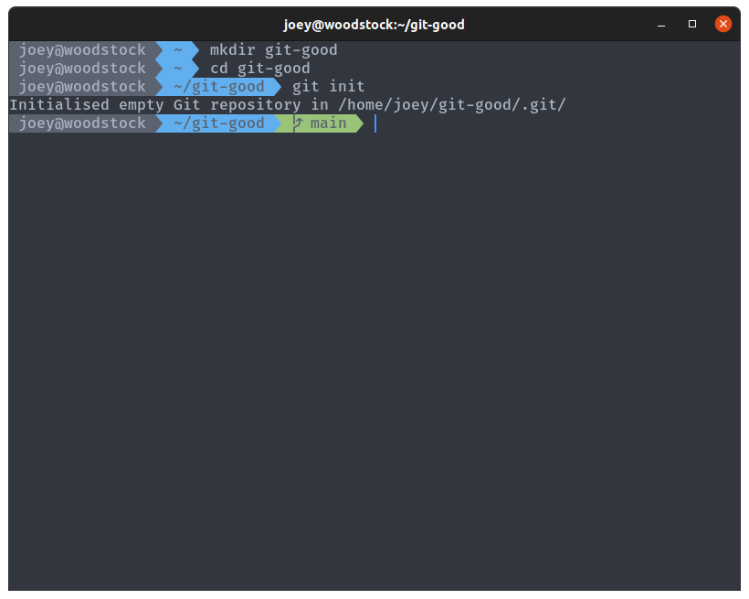

The command `git status` will tell you about the current state of your repository. Run it, and your output should look as shown. We're on the default branch (if it is master, run `git branch -m main` to rename it), and we have no commits and nothing to commit (the folder is empty).

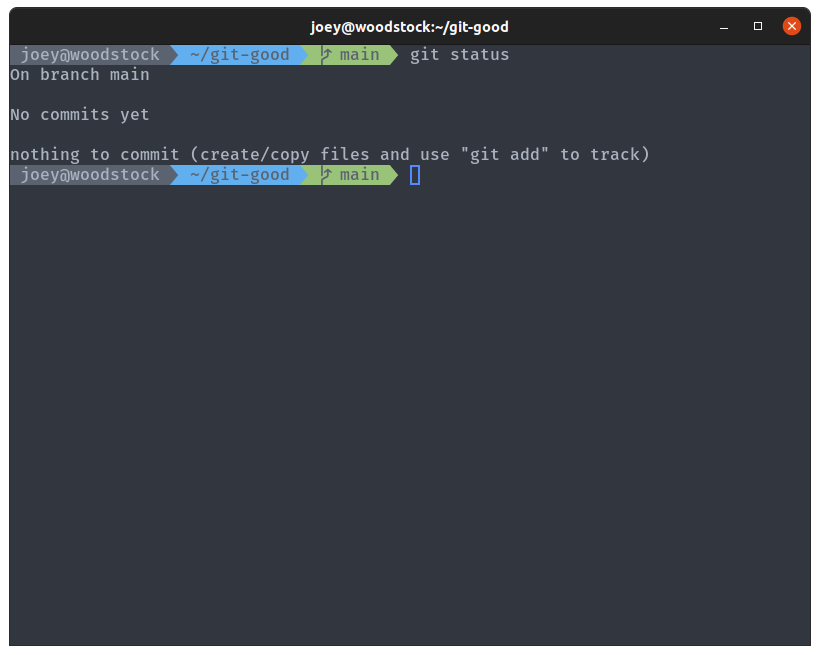

## Git commit

Let's add a few files so we have something to play with. Create a file `FibonacciCalculator.java` with the following contents:

```java
public class FibonacciCalculator {
    public int calculate(int n) {
        if (n <= 0 || n == 1)
            return n;
        else
            return calculate(n - 1) + calculate(n - 2);
    }
}
```

This file is a simple class designed to calculate Fibonacci numbers (the actual code doesn't matters). If you check `git status` again, you'll notice it has updated to show that we have a single file, untracked by git.

We're going to create our first commit. A commit is simply a snapshot of the repository at any point in time, and we take a snapshot every time we make a commit. The first step is to **stage** the untracked file, which adds it to the staging area, a list of changes that are ready to commit. This is done using the `git add` command:

```sh
git add FibonacciCalculator.java
```

Then, once we're happy with the state of the staging area, we can create a new commit using `git commit` to save the current state of the repository as a commit. Don't forget to add a commit message to tell people (and yourself) what changes are included in your commit:

```
git commit -m "Initial commit, added FibonacciCalculator class."
```


Take note of how the output of `git status` changes between each command. If this is your first time using Git on this machine, it may prompt you to set your name and email address in settings before you can make commits. This is so it can attach your identity to the commit messages. Run the two commands below to do that, substituting your name and email, then create the commit.

```
git config --global user.name "YOUR NAME HERE"
git config --global user.email "YOUR EMAIL HERE"
```

We're going to add another file and make another commit for it. Create the Java file `Fibonacci.java` with the contents below:

```java
public class Fibonacci {

    public static void main(String[] args) {
        int n = parseArgs(args);
        if (n == -1) {
            System.err.println("Invalid Arguments");
            return;
        }

        FibonacciCalculator fibonacciCalculator = new FibonacciCalculator();

        for (int i = 0; i < n - 1; i++) {
            System.out.print(fibonacciCalculator.calculate(i) + ", ");
        }
        System.out.println(fibonacciCalculator.calculate(n - 1));
    }

    private static Integer parseArgs(String[] args) {
        if (args.length != 1 || args[0] == null)
            return -1;

        int n;
        try {
            n = Integer.parseInt(args[0]);
        } catch (NumberFormatException e) {
            return -1;
        }

        if (n < 0)
            return -1;
        return n;
    }
}
```

Compile both files with `javac`, and have a play around generating sequences with `java Fibonacci <n>`

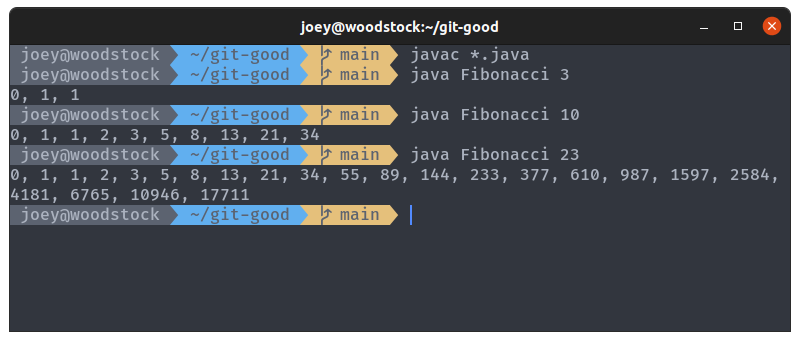

Follow the same steps as before to create a new commit to add `Fibonacci.java`:

- Use `git add Fibonacci.java` to stage it
- Use `git commit` to create the commit
  - Don't forget `-m` for a commit message

Always keep checking your `git status` as you go, so you can see what is changing as you execute commands.

If you run `git status` now, you will see that you still have two untracked files, the two compiled class files. Do you want to create a commit to check these into Git? Committing complied files and binaries to Git is generally considered bad practice (don't want to include generated files). So let's create a `.gitignore`. A `.gitignore` is a special file that tells git to completely ignore certain files and pretend they aren't there. Create a file called `.gitignore`, and in it add a single line:

```
*.class
```

`.gitignore` uses [glob syntax](https://git-scm.com/docs/gitignore) to specify what files to ignore, allowing you to add patterns such as our wildcard pattern for all files with names ending `.class`. You will have to commit the `.gitignore` file, however, so go through the same steps as before to add and then commit it.

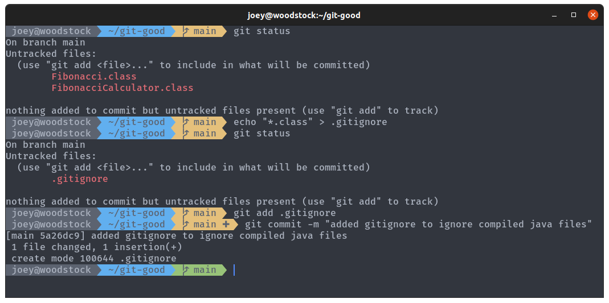

## Git log

We have created three commits in total now, which we may want to browse at some point to see what we or other people have done. We can use `git log` to view the commit history of our branch:


The top commit marked (HEAD -> main) shows where our branch is currently at. This commit history shows a lot of info, and we can customise what is shown using options passed to `git log`. Commit histories can be thousands of commits in some repos, so the output is piped into a pager, which allows you to scroll through Take a look at [the man pages](https://git-scm.com/docs/git-log) for full details, but you can just try Sam's favourite options for now:

```
git log --color --oneline --graph --decorate --all
```


## Git checkout

So we can see the commit history, what if we wanted to go and check out previous commits? `git checkout` does exactly that, allowing us to move around between different commits and branches. Remember those long strings of letters and numbers from `git log`? Those are **commit hashes**, and are used to uniquely identify each commit. We can view the state of the repo as it was when we made those commits using `git checkout <hash>`. We can also jump back by 1 commit (or more) using `git checkout HEAD~1`. `HEAD` is used to refer to where we currently are in the commit history, and you can see it in the output of `git log`. At any point, you can do `git checkout main` to jump back to the `main` branch.

Have a browse of your commit history by jumping to different commit hashes. The commit hash for your own commits will be different to the ones shown in my screenshots, so you'll need to use those. You don't need the full hash, just the first 4/5 characters will do it (until there is a unique match).

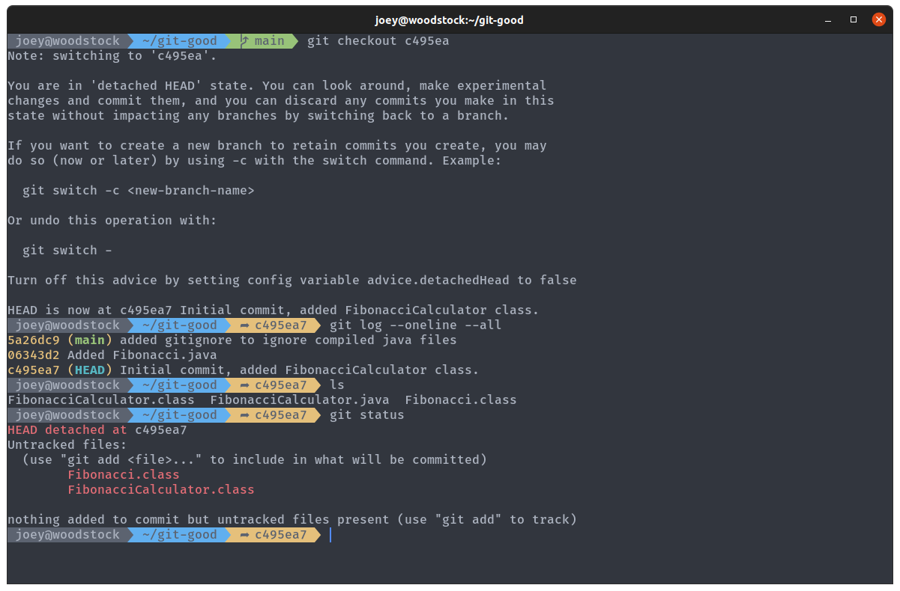

Jumping back to a previous commit shows us where our `HEAD` is in the log, and shows the status as `HEAD detached`. The `.gitignore` and `Fibonacci.java` files are gone from the directory, because they weren't present in this commit.

The two `.class` files are still here though, because Git has ignored them like we told it to. They're showing up in the `git status` because the `.gitignore` file is gone, so it isn't ignoring them.

Switch back to the most up-to-date version with `git checkout main`.

## Git reset

You might have noticed that our method for calculating Fibonacci numbers is really inefficient. Let's fix this by updating `FibonacciCalculator.java`. Copy and paste the code below to replace the entire file.

```java
public class FibonacciCalculator {
    public int calculate(int n) {
        return fib(n, 1, 0);
    }

    private int fib(int term, int val, int prev) {
        if (term == 0)
            return prev;
        return fib(term - 1, val + prev, val)

    }
}
```

The new calculate method is just a wrapper for `fib`, the new recursive method which has only a single recursive call instead of two, making it much faster. Create a new commit to update `FibonacciCalculator.java`.

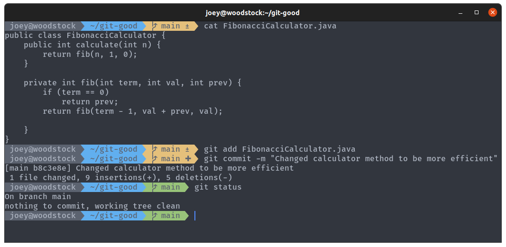

If you copy-pasted the above code and tried to compile the file, you will notice that there has been a drastic mistake. Somehow, one of the semicolons has gone missing. How ridiculous! We need to move our branch back one commit to remove this very embarrassing mistake from the commit history.

`git reset` is similar to git checkout, but allows us to make more permanent changes to the commit history. As well as moving the `HEAD` pointer, it moves the current branch pointer with it. Run the command `git reset HEAD~1` to move undo that commit.

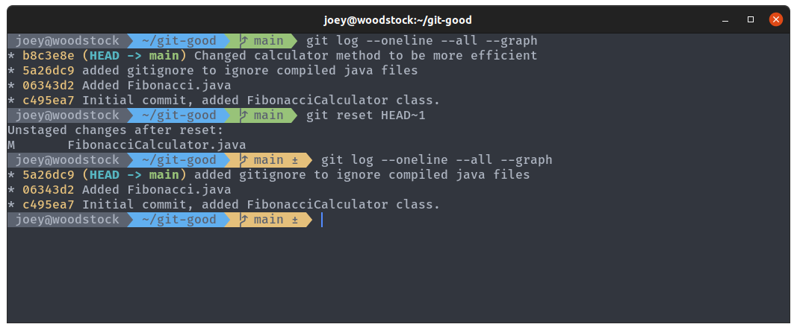

Using `git reset` like this has left the changes in place, so we can just go into the file and add our semicolon. Add the changes and commit, as before. Have a look at your new commit history, and we can see that the old commit with the error has gone.

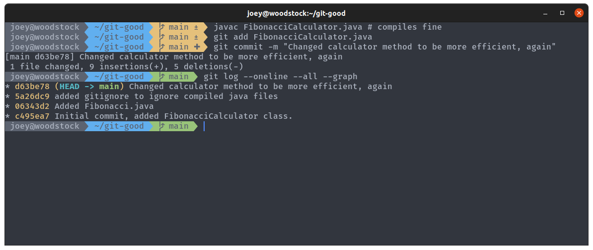

Note how the commit hash and message have changed? It's an entirely different commit, that we checked worked before we committed it. You should always test your code _before_ you commit!

There are a few different ways to use `git reset`, and editing commit history is not a good idea if the repository is shared with other people (you don't want to have different versions of history). However, in this instance for a small mistake like this it's generally okay.

## Git remote

I'm sure everyone has heard of GitHub. It's main function is to provide remote hosting and collaboration tools for Git repositories. If you don't have an account already, [sign up](https://github.com/signup), and then [create a new repo](https://github.com/new). Name the repository `git-good`, and just leave the rest of the fields as they are for now.

Go back to your terminal, where we're going to add GitHub as a remote for our local repo. Remotes work by allowing you to push and pull commits to and from remote branches, keeping your local copy up to date with the remote. This is useful when multiple people are working on the same repo, or when you're working on the same repo on multiple machines. You can commit all your changes on your laptop, push them to GitHub, and then pull all your changes down to another copy of the same repo on the DCS machines. Like Onedrive, but with extra steps (and better organized).

The command `git remote add origin https://github.com/<username>/git-good` will add the GitHub repo as a remote repo named `origin` . Then, run `git push -u origin main` to move (`push`) your changes onto the remote `origin`. `origin/main` is used to refer to the remote copy (on `origin`) of the local branch `main` . This makes`origin/main` 'track' your `main` branch. `origin` is the name usually given to the remote, as it is often where the repo *origin*ates from.

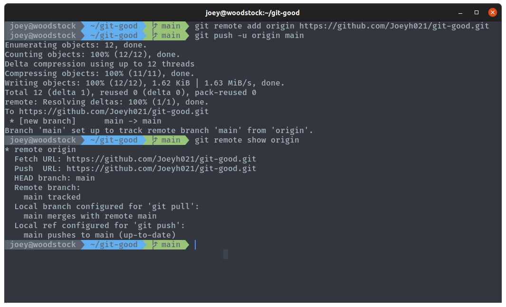

Git might prompt you for a username and password to be able to push to your remote repo. The username is the email address you log in with, and for the password you'll need a [Personal access token](https://docs.github.com/en/authentication/keeping-your-account-and-data-secure/creating-a-personal-access-token).  If you want to save your credentials for later, run `git config --global credential.helper store`, and then the next time you are prompted for an email and access token they will be saved. Be aware that it will be saved as plain text on disk though, so I recommend looking into a more secure way to remotely access GitHub (eg, via SSH).

Refresh your GitHub repo page, and you should see your files there.

## Git branch

Another major feature of Git is branches. Branches allow you to have multiple versions of a repo with a shared history, and are really Git's killer feature. Branches are usually thought of as branches on a tree, but they're more like pointers to commits in the commit graph. The `main` branch is the default pointer, and when we commit to it Git creates a new commit with whatever the current `main` branch is pointing to as it's parent, then moves the pointer forward one. For a more detailed description, take a look at [the Git book](https://git-scm.com/book/en/v2/Git-Branching-Branches-in-a-Nutshell).

Our new branch is going to be called `iterator`, because we're going to add an alternate Fibonacci class that is an [Iterator](https://docs.oracle.com/javase/8/docs/api/java/util/Iterator.html), allowing us to more efficiently generate a sequence of numbers (again, the exact code doesn't really matter).

First, run `git checkout -b iterator` to create and then switch to a new branch, `iterator`. If you run `git log --oneline --all --graph`, you'll see main, our new branch, and the remote branch all point to the same commit. More importantly, `HEAD` is now pointing to the branch `iterator`, meaning new commits will be added to this branch.

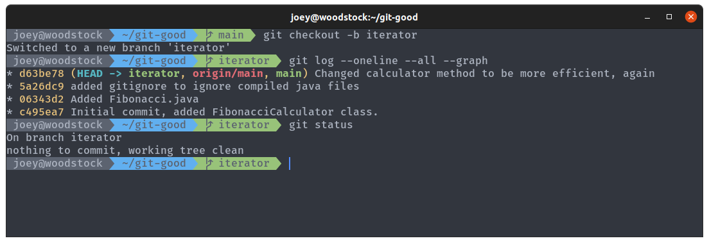

Create the new `FibonacciGenerator.java` file:

```java
import java.util.Iterator;

public class FibonacciGenerator implements Iterator<Integer> {
    private int max;
    private int n = 0;
    private int a = 0;
    private int b = 1;

    FibonacciGenerator(int max) {
        this.max = max;
    }

    @Override
    public boolean hasNext() {
        return n < max;
    }

    @Override
    public Integer next() {
        int x;
        if (n == 0)
            x = 0;
        else
            x = a + b;

        a = b;
        b = x;
        n++;
        return x;

    }
}
```

And update `Fibonacci.main`:

```java
public static void main(String[] args) {
    int n = parseArgs(args);
    if (n == -1) {
        System.err.println("Invalid Arguments");
        return;
    }

    FibonacciGenerator fibonacciGenerator = new FibonacciGenerator(n);
    while (fibonacciGenerator.hasNext()) {
        System.out.print(fibonacciGenerator.next() + ", ");
    }
    System.out.println();
}
```

Then, making sure you're on the iterator branch, make a new commit with these changes. Make sure everything works properly first, you don't want to have to go reverting commits.

You might want to work on your new feature later elsewhere, so let's push the branch to GitHub. Each branch has to be pushed separately, and when you first push a branch you have to include the `-u` flag to create the upstream (remote) branch. `git push -u origin iterator` will push the iterator branch to origin.


Your branch should now be visible on GitHub, and you can view the different branches using the dropdown menu to the top-left of the files:


Run `git checkout main` to switch back to the main branch.

## Git merge

Have you noticed a subtle bug in our implementations? See what happens if you run `java Fibonacci 0`, on either branch. On `main`, with our recursive method, you blow the stack with a call to `calculate(-1)`. On the `iterator` branch, you just get nothing printed to the console. Don't forget to recompile when changing branches!

**Let's fix this error on `main`.** Switch to it using `git checkout main`, and then update the `Fibonacci.parseArgs` method so that the conditional check at the bottom goes from `if (n < 0)` to `if (n <= 0)`. Calling the program with `0` as an argument now should give an error (why would we call a program to print nothing anyway?). Commit the change to `main`, and then push the change with `git push`. We don't have to specify the remote or branch this time because Git already knows where we want to push this branch to.

Check your git log now. You should be able to see your two branches with diverging commit histories, and be able to switch between them and the two versions of the code.

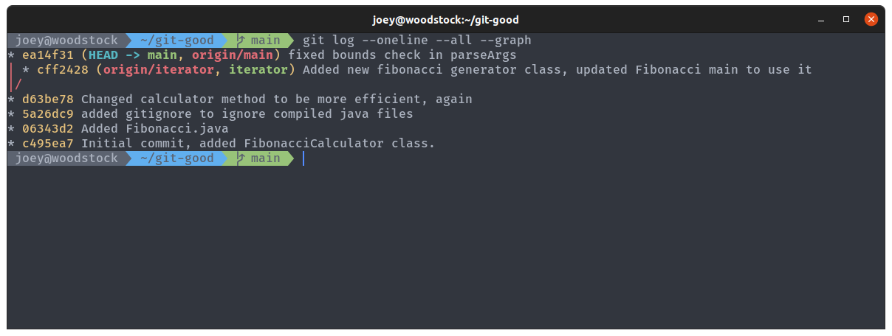

We've decided now that the iterator branch is done, and we want to update main to include the changes we made. Git lets us do this using `git merge`, which copies the changes from one branch into another, combining their changes. Merging gets really complicated when you have lots of commits to merge or conflicting changes, but we'll keep it simple for now. Making sure you're on main and that your working tree is clean (nothing modified), run `git merge iterator` to merge iterator *into the current branch*. Git might prompt you to enter a commit message, in which case just leave it as the default.


See the little graph in the git log? The `main` branch is now on our new merge commit, which combines the two previous commits into a new commit with both sets of changes. Take a look at your code to see how the merge has been applied, and check the bug has been fixed along with using the new iterator method for the sequence.

## Git pull

You can push your updated `main` branch up to GitHub with `git push`. We won't be needing the `iterator` branch anymore because we merged the changes in, so run `git branch -d iterator` to delete it on the local repo, and `git push -d origin iterator` to delete it on the remote. You should see these changes reflected on GitHub.

You might notice GitHub asking you to add a README:


READMEs are files that are displayed on your repo's homepage, and are designed to tell users about the repo, along with any instructions on how to install/compile/use/configure your software. Let's go ahead and do that. Click that big green button, and add the following contents to the file:

```md
# Git Good

This repository contains a simple Fibonacci sequence program that I created as part of [UWCS's Git Good workshop](https://uwcs.co.uk/resources/git-good-2022/).

## Dependencies

A Java compiler and runtime, JDK 11 or newer.

## Compilation

Compile all the Java files with `javac *.java`.

## Usage

Run `java Fibonacci n` to generate the first `n` Fibonacci numbers and print them to standard output, starting from 0.
```

READMEs on GitHub are usually formatted with Markdown, a lightweight syntax for document formatting. I'd thoroughly recommend learning it if you aren't already familiar: <https://www.markdownguide.org/>. This workshop is written in Markdown too!

Commit the changes directly to `main` using the options at the bottom of the page, and you should see your lovely readme rendered on your repo's homepage.

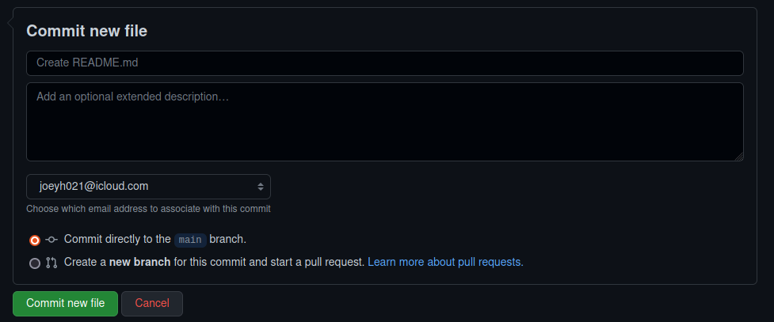

Go back to your terminal, and have a look at your repo again. `README.md` was committed to the remote, but your local has not yet been updated to reflect the change. Use `git pull` to update `main` by fetching all the changes from the remote and merging them into your local `main`. `README.md` should appear in your local repo.


## Git with friends

(\* `with-friends` is not a real git command.)

I mentioned earlier that GitHub is mainly used for its powerful collaboration features. The centre of this is **pull requests**, which allow you to propose changes to repositories. If multiple people are working on a project, they may all submit pull requests which contain their work, and a project manager would accept pull requests and merge them into the repo. Or, if you find a random repo on GitHub you wish to make changes to, you can **fork** your own copy of it, make a change, and then submit a pull request. Despite the name, pull requests are actually merge requests (which is what GitLab calls them), as you're requesting the owner merge your changes into the repo. The full GitHub docs on pull requests are at <https://docs.github.com/en/pull-requests>.

The basic workflow for making a PR on someone else's repo is:

- Fork their repo so you have your own copy
- Use `git clone` to download your fork to your machine
- Make a new branch
- Commit changes to that branch
- Push the branch to your fork
- Submit the pull request 

Let's get some practice by making a pull request on someone else's repo. What's the largest Fibonacci number you can generate? The 48th Fibonacci number should be negative, because we've started generating numbers that are too large to fit into our 32 bit `int` type, it's **overflowed**. We're not going to patch our own code to fix this though, we'll patch someone else's and let them patch ours.

Find a friend (talk to someone sat next to you, ask on discord our use [our repo](https://github.com/UWCS/git-good)), and ask them for a link to their GitHub repo with their Git Good code from this workshop stored in it. Use the fork button in the top right of their repo to fork it, which creates a copy of your friend's repo under your name. **Give the fork a different name to your own `git-good` repo**, because you can't have two repos with the same name.

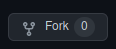

Go back to your terminal, and run `git clone https://github.com/<your username>/<forked repo name>`. This downloads the fork to your local machine, creating a local repo that you can push to your fork from. We want to create a new branch to commit our changes to, so create a branch for our changes called `patch-overflow` with `git checkout -b`.

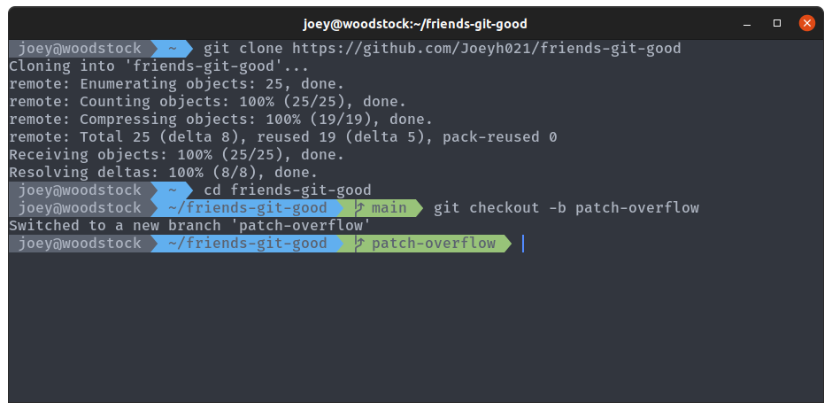

We want to go into `FibonacciGenerator.java` and change some of the types `int` to `long`, and `Integer` to `Long`. `Long` types are 64 bits instead of 32, so will allow us to generate even larger numbers. Note that this won't fix the problem completely, it will just overflow at 96 now instead of 48. See if you can work out which variables need changing yourself, but the full changed file is shown below if you get stuck.

```java
import java.util.Iterator;

public class FibonacciGenerator implements Iterator<Long> {
    private int max;
    private int n = 0;
    private long a = 0;
    private long b = 1;

    FibonacciGenerator(int max) {
        this.max = max;
    }

    @Override
    public boolean hasNext() {
        return n < max;
    }

    @Override
    public Long next() {
        long x;
        if (n == 0)
            x = 0;
        else
            x = a + b;

        a = b;
        b = x;
        n++;
        return x;

    }
}
```

Make the change, then make a new commit on the `patch-overflow` branch with an appropriate commit message for your friend to see what you've done to their code. Push the change to your fork using `git push -u origin patch-overflow`.


We're done on our machine now, back to GitHub. Go to your friend's repo, and click on the pull requests tab at the top. You should see something like this, showing you that your repo had recent pushes and suggesting you open a PR.


Click the big green button, and you should be able to see a page with all the info for your pull request. You can add a comment, change the repos/branches, and see the diff at the bottom. GitHub is really good at showing diffs, summarising changes between versions of files.

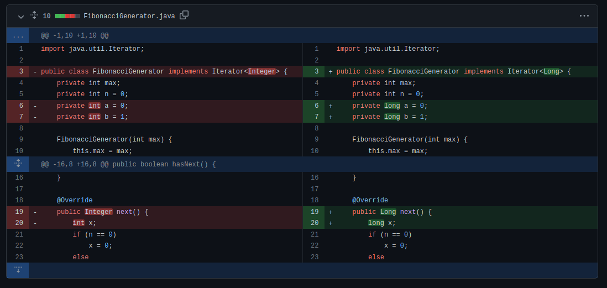

Create the pull request with the big green button again, and your new pull request should appear in your friend's repo, where you can both see the PR with the commits, changes made, any comments and messages etc. Ask your friend very nicely to accept your PR, and GitHub will merge the branch from your fork into their `main` branch. Your changes are now part of their repo, and they can pull them down to their local repo with `git pull`, and try out your patch.

## Next Steps & Further reading

Some more advanced topics in Git for you to look into:

- **Rebasing** is another method for combining two version histories
- **Cherry picking** allows you to pick commits from one branch and append them to another
- Merging can get hard when you have **merge conflicts**,  when two files to be merged are both edited
- There are different **merge strategies** you can choose from to merge branches the way you want

GitHub is a really powerful platform, and there's so much more you can do with it:

- Issues and Pull Requests can be used to collaborate on projects and keep track of progress and bugs/features
- A good GitHub profile acts as a portfolio when applying for jobs
- When working in group projects, use GitHub to store your code and collaborate
- GitHub has unlimited private repos, which is great for keeping track of coursework
- The [GitHub Student Developer Pack](https://education.github.com/pack) has loads of stuff for students. Verify your account with your `@warwick.ac.uk` email to get free GitHub pro, and a bunch of [other free goodies](https://education.github.com/pack).

Other Git resources worth having a look at for learning more:

- [Oh Shit, Git](https://ohshitgit.com/)
- [GitHub Minesweeper](https://profy.dev/project/github-minesweeper)
- [Learn Git Branching](https://learngitbranching.js.org/)
- [The GitHub Documentation](https://docs.github.com/en)
- [The Pro Git Book](https://git-scm.com/book/en/v2)